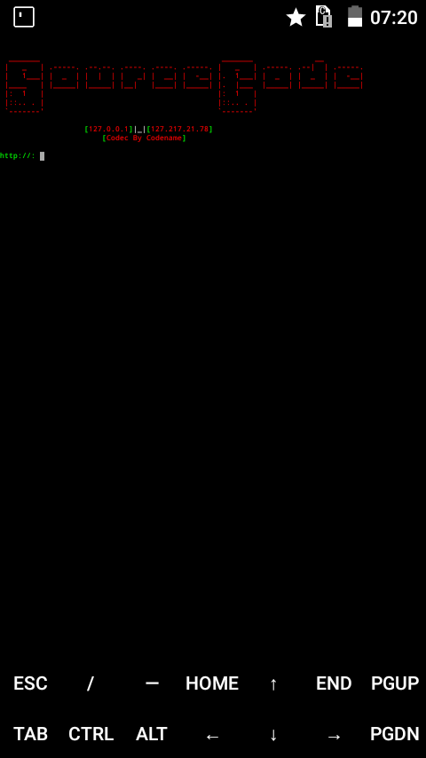

# SourceCode
Tools TakeScript 

# Screenshot

# Installation
...
$ apt-get update
$ apt-get upgrade
$ apt-get install git
$ apt-get install python2
$ git clone https://github.com/nishinosukasa/SourceCode.git
$ cd SourceCode
$ python2 Source.py
...

# Website
https://cruznos.blogspot.com<br
https://nostalgiaxploit.wordpress.com

# Contact
siwanna8@gmail.com
